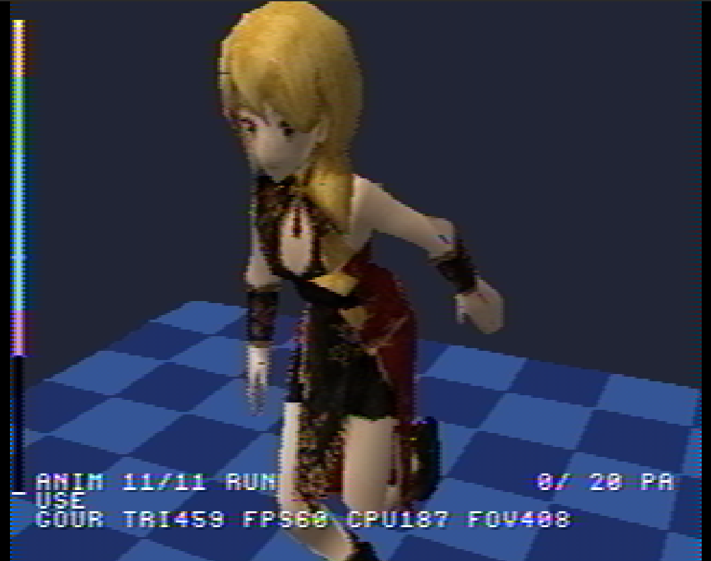
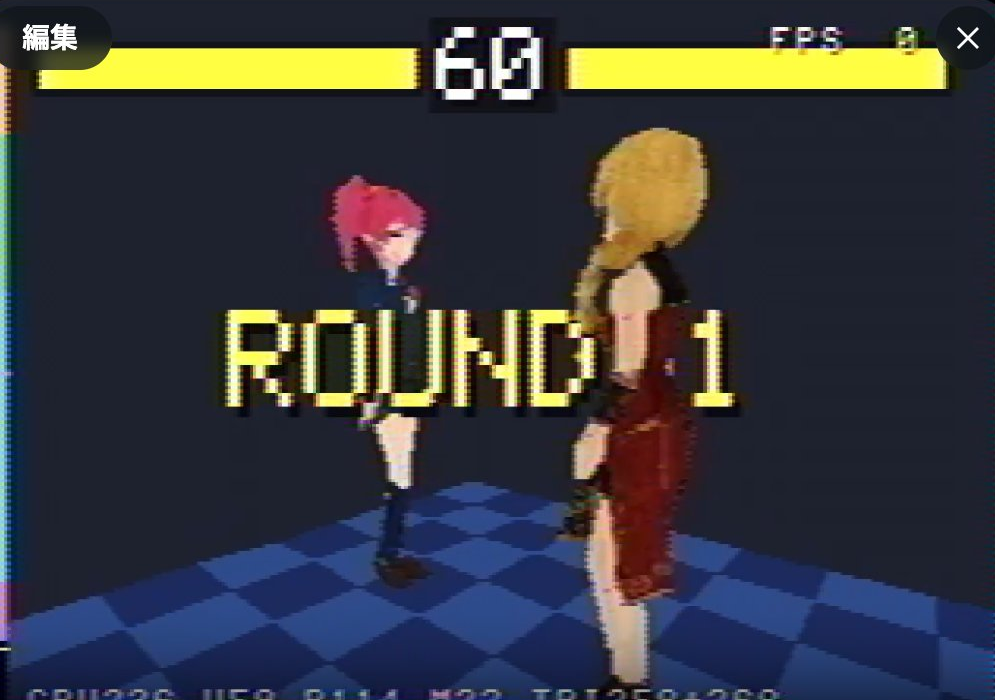

# 御意見有用

**初代 PlayStation 向けの 3D 対戦格闘ゲーム**

開発: **東池袋ナル**

---

## 皆様の意見でゲームが進化します

**「御意見有用」は、皆様の声で育つ格闘ゲームです。**

遊んで気づいたこと、欲しい技、バランスの感想、バグ報告 — なんでも「御意見フォーム」に書いてください。

- **要望やバグを見つけたら** → AI が実装します
- **push のたびに自動ビルド** → タグ付けで ROM をリリース

アドバイス大好きっ子集まれ〜！

📥 **[最新リリースをダウンロード](../../releases/latest)** ｜ 📝 **[御意見フォームを開く](../../issues/new/choose)** ｜ 📋 **[既存の御意見を見る](../../issues)**

---

## 遊び方

**[遊び方ガイドを見る →](docs/遊び方.md)**

モード選択、操作方法、ビューアの使い方などは遊び方ガイドをご覧ください。

---

## このプロジェクトについて

旧称 NULL FIGHTER。ソースやビルド成果物の名前（`nullfighter.cue` など）には旧称が残っています。

**このリポジトリのコードとツールは、すべて Claude Code（Claude Fable 5.1）だけで書かれています。** 人間がやったのは日本語で要望を出すこと、画面を見て感想を返すこと、素材を渡すことだけです。

素材も生成 AI 製です。キャラクターのデザイン画は ChatGPT、そこからのモデル・テクスチャ・リグ・アニメーションは Tripo3D で作りました。

### 主な特徴

- バーチャファイター風の 3D 対戦格闘（1P / VS / CPU の 3 モード、32 種の技、コンボ、戦略 AI）
- Tripo3D 生成モデルを PS1 用に変換、60fps で動作
- Dancing Eyes 風のミニゲーム（ビューアモード）

---

## 開発者向け

ビルド方法、ソースコード構成、アセットパイプラインの詳細は **[技術ドキュメント](docs/TECHNICAL.md)** をご覧ください。

---

## クレジット

- 企画・開発: 東池袋ナル
- コード: Claude Code（Claude Fable 5.1）
- キャラクターデザイン: ChatGPT
- モデル・テクスチャ・リグ・アニメーション: Tripo3D

## ライセンス

未定。アセット（FBX、テクスチャ）は Tripo3D / ChatGPT の利用条件に従います。
